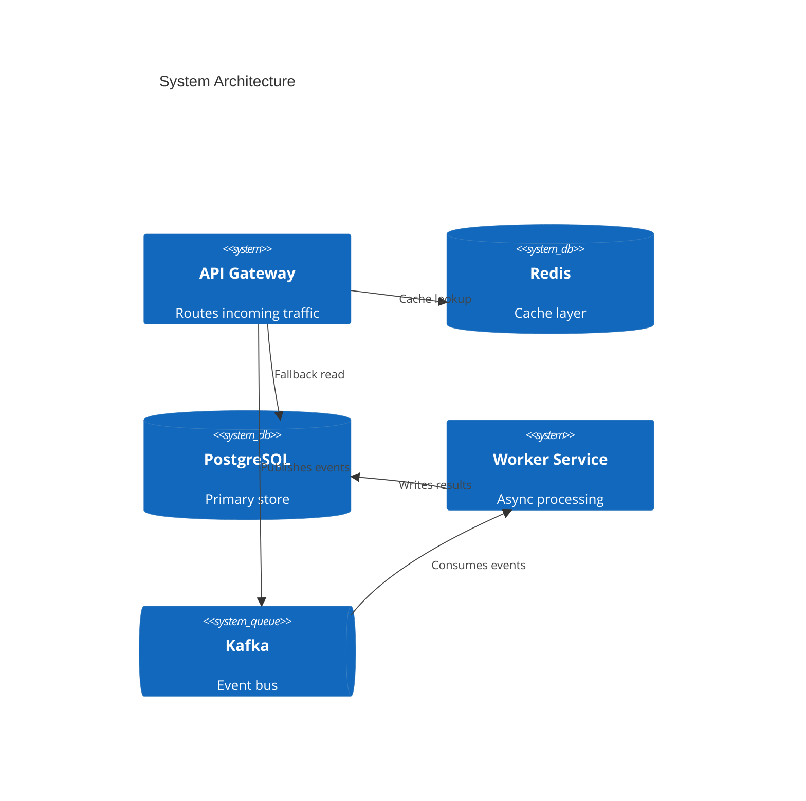

# C4Flow

**Turn static Mermaid C4 diagrams into animated traffic simulations — entirely in the browser.**

C4Flow is a client-side web tool that parses Mermaid C4 architecture diagrams and renders them as live, animated system traffic visualizations. Write your architecture in the editor, define traffic patterns, and watch requests flow between services in real time.

No backend. No dependencies. Just paste your diagram and hit play.

## What it does

- **Editor panel** — Write or paste Mermaid C4 diagrams directly in the browser with syntax highlighting
- **Live renderer** — Parses the diagram and renders an interactive, animated canvas showing services, connections, and request traffic flowing between them
- **Traffic simulation** — Animated dots represent requests moving through the system, with configurable rates, colors, and patterns per connection
- **Counters & metrics** — Real-time stats panel showing requests processed, cache hits, batches, and throughput per service
- **Step-through narration** — Walk through the architecture flow step by step, ideal for presentations and onboarding
- **Zero backend** — Everything runs client-side. Export your visualization as a standalone HTML file you can share or deploy anywhere

## Quick start

```bash
git clone https://github.com/<your-user>/c4flow.git
cd c4flow
npm install
npm run dev
```

Open `http://localhost:5173`, paste a Mermaid C4 diagram in the editor, and the visualization renders live on the right panel.

## Example input



## Traffic configuration

Define traffic patterns inline using YAML front matter or a separate config block:

```yaml
traffic:
  - edge: gateway -> redis
    rate: 1000/s
    type: cache
    color: orange
  - edge: gateway -> postgres
    rate: 200/s
    type: fallback
    color: cyan
  - edge: gateway -> kafka
    rate: 1000/s
    type: event
    color: green
  - edge: kafka -> worker
    rate: 1000/s
    type: batch
    color: purple
```

## Architecture

```
┌─────────────────────────────────────────────┐
│                  Browser                     │
│                                              │
│  ┌──────────────┐   ┌────────────────────┐  │
│  │    Editor     │   │     Renderer       │  │
│  │              │   │                    │  │
│  │  Mermaid C4  │──▶│  Canvas/SVG        │  │
│  │  + Traffic   │   │  Animated dots     │  │
│  │    config    │   │  Metrics panel     │  │
│  │              │   │  Narration bar     │  │
│  └──────────────┘   └────────────────────┘  │
│         │                    ▲               │
│         ▼                    │               │
│  ┌──────────────────────────────┐           │
│  │         Parser               │           │
│  │  Mermaid C4 → JSON Graph    │           │
│  │  Traffic YAML → Config      │           │
│  └──────────────────────────────┘           │
└─────────────────────────────────────────────┘
```

## Tech stack

- **TypeScript** — End to end type safety
- **Canvas API** — High-performance rendering for animated traffic dots
- **Vite** — Dev server and build tooling
- **CodeMirror** — Editor with syntax highlighting
- **Zero runtime dependencies** — Core parser and renderer are dependency-free

## Roadmap

- [x] Project setup and README
- [ ] Mermaid C4 parser → JSON graph
- [ ] Static canvas renderer (nodes + edges)
- [ ] Traffic animation engine (animated dots along paths)
- [ ] Editor panel with live preview
- [ ] Metrics counters panel
- [ ] Step-through narration mode
- [ ] Traffic YAML config support
- [ ] Export as standalone HTML
- [ ] Theme customization (dark/light, color palettes)
- [ ] Layout algorithms (force-directed, hierarchical, manual)

## License

MIT
